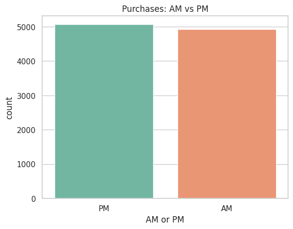
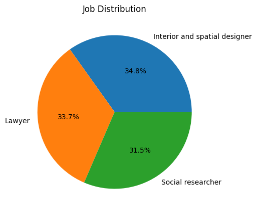
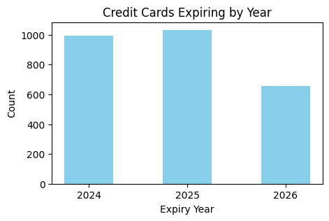
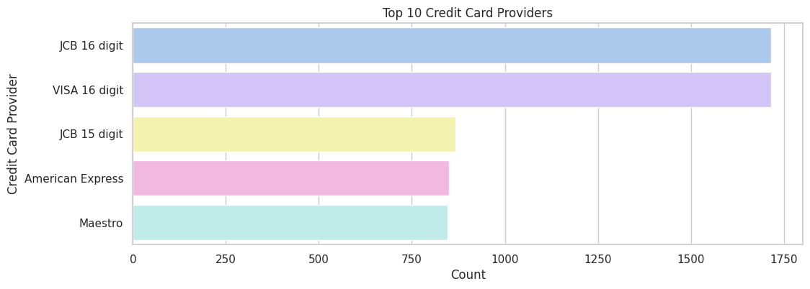

# E-commerce Purchase Analysis

This project analyzes an **E-commerce Purchases dataset** using Python libraries: **NumPy, Pandas, Matplotlib, and Seaborn**. The dataset was sourced from Kaggle: [E-commerce Purchases](https://www.kaggle.com/datasets/utkarsharya/ecommerce-purchases). Created on Google Colab.

---

## 📊 Dataset Overview
- **Rows:** 10,000  
- **Columns:** 14  
- **Features:** Address, Lot, AM/PM, Browser Info, Company, Credit Card, CC Exp Date, CC Security Code, CC Provider, Email, Job, IP Address, Language, Purchase Price  
- **No missing values**

---

## 🔎 Key Insights
- **Purchase Price:**  
  - Highest: 99.99  
  - Lowest: 0.0  
  - Average: 50.34  
- **Language:** 1,097 customers use French (`fr`).  
- **Credit Card Expiry:**  
  - 988 cards expire in 2020.  
  - Expiry counts for 2024–2026: 992, 1033, 654 respectively.  
- **Email Providers:** Top 5 are Hotmail, Yahoo, Gmail, Smith.com, Williams.com.  
- **Time of Purchase:**  
  - AM: 4,932 purchases  
  - PM: 5,068 purchases  
- **Credit Card Providers:** JCB (15 & 16 digit), VISA, American Express, Maestro dominate.  

---

## 📈 Visualizations
- **Purchases by Time of Day (AM vs PM)** – Bar chart showing nearly equal distribution.  
- **Customer Job Breakdown** – Pie chart highlighting Interior Designers, Lawyers, and Social Researchers.  
- **Credit Card Expiry by Year** – Bar chart for 2024–2026.  
- **Top Credit Card Providers** – Horizontal bar chart of top 10 providers.  

---

## 🖼️ Images Section

  
  
  

---

## 🛠️ Tools & Libraries
- **Pandas** – Data cleaning, filtering, grouping  
- **NumPy** – Numerical operations  
- **Matplotlib & Seaborn** – Visualizations  

---

## 🚀 Business Impact
This analysis helps understand:  
- Customer demographics (jobs, languages, email domains)  
- Purchase behavior by time of day  
- Credit card provider trends and expiry risks  

Such insights can guide **marketing strategies, fraud detection, and customer segmentation**.

---

