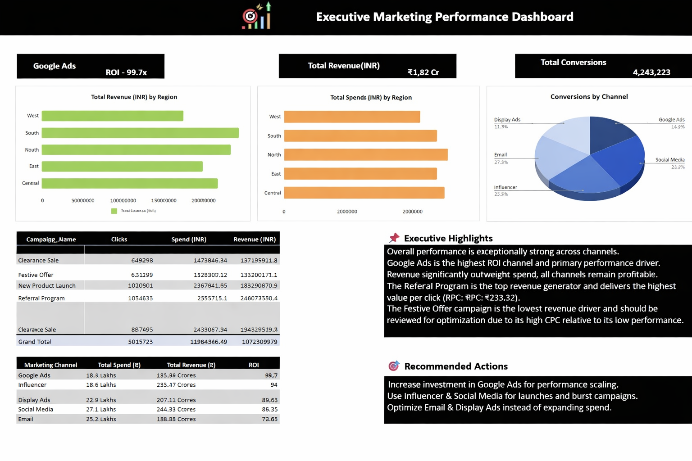
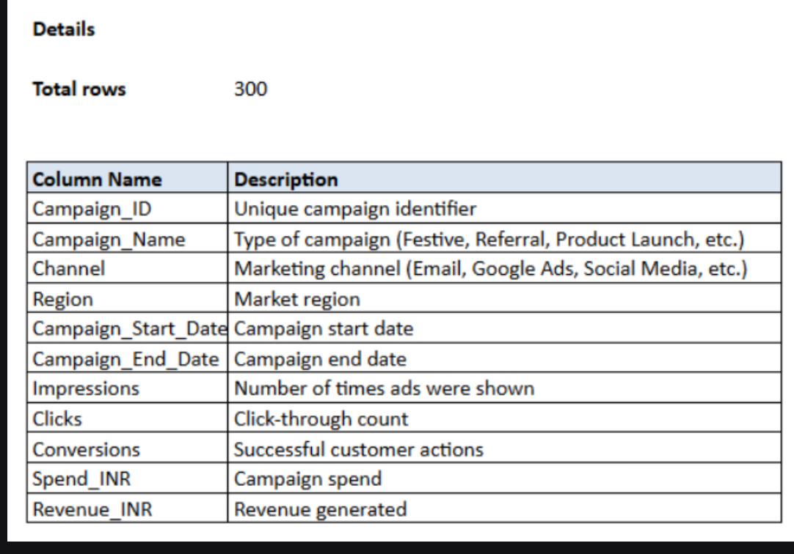
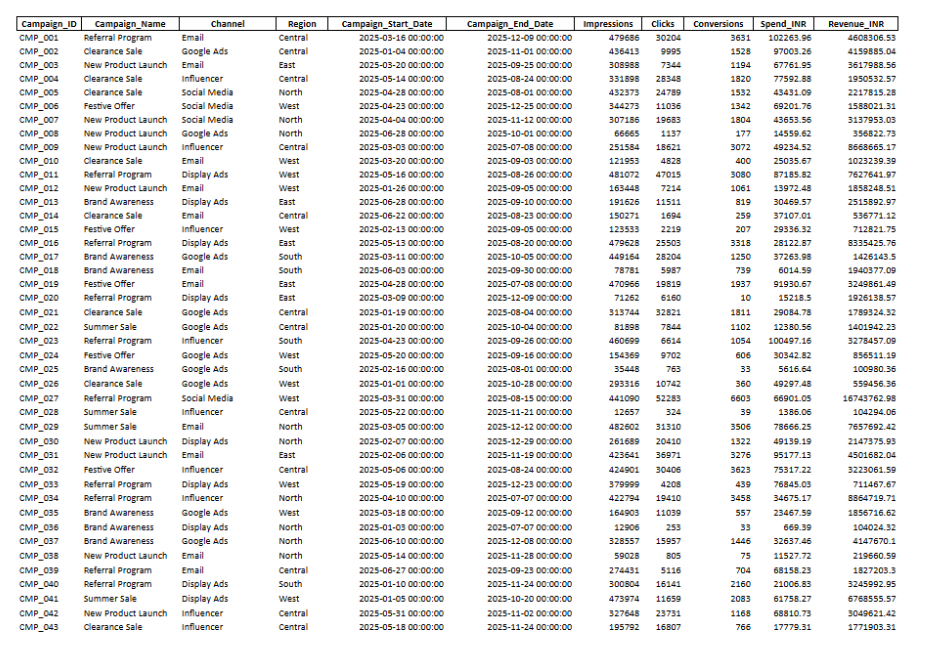

# 📌 Project Overview  

This project demonstrates how **Excel** combined with **Copilot** was used to build an executive-level marketing performance dashboard.

It showcases ROI, revenue, and conversion efficiency across multiple campaigns and channels, enabling data-driven decision-making.

The dataset consists of 300 rows and was created using Copilot.

---

# 🎯 Purpose  

- Highlight how human expertise and Copilot collaboration accelerate insight generation.
- Showcase business impact through actionable recommendations.
- Demonstrate **visual alignment and formatting choices** for clarity and professional presentation.

# 🎯 Key Metrics  

- **Total Revenue:** ₹1.82 Cr
- **Total Conversions:** 4.24M
- **Google Ads ROI:** 99.7x (highest-performing channel)
- **Referral Program:** Top revenue generator with highest value per click (RPC ₹233.32)

---

# 📸 Screenshots  

