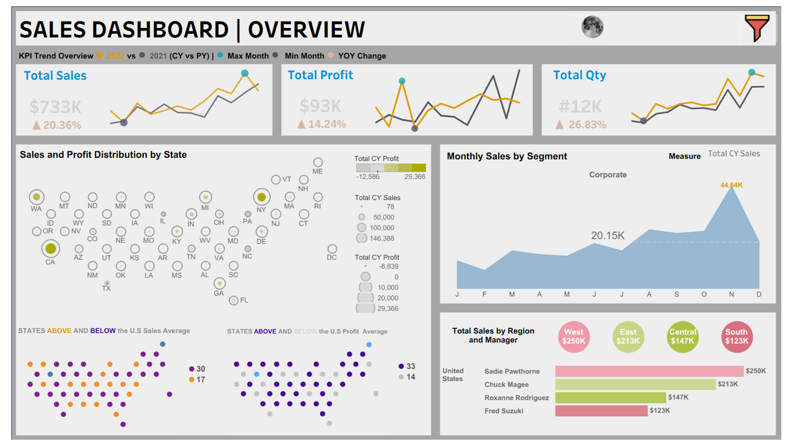
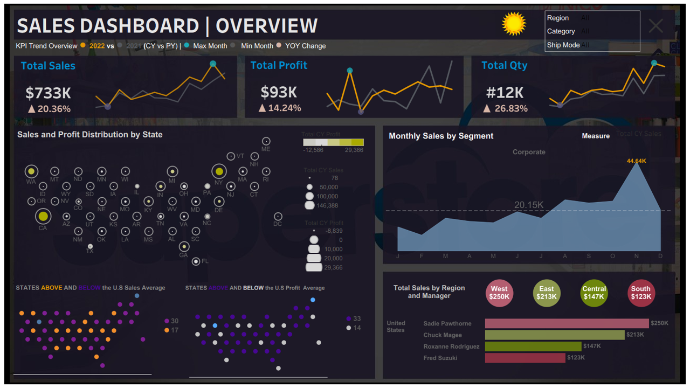

# Sales Performance Dashboard (Tableau)

## 📊 Overview
This project showcases an interactive **Sales Dashboard** built in Tableau, designed in both **Light** and **Dark** themes for versatility.  
The dashboard provides a comprehensive view of **sales, profit, and quantity trends**, enabling quick insights into performance across regions, states, and customer segments.

---

## 🎯 Key Features
- **KPI Panels**: Track total sales, profit, and quantity with YoY growth percentages.
- **Geographic Analysis**: Map visualization of sales & profit distribution across U.S. states.
- **Trend Analysis**: Monthly sales trends segmented by customer type.
- **Regional Insights**: Breakdown of sales by region and manager performance.
- **Theme Variations**: Light and Dark versions for presentation flexibility.

---
## 🔑 Key Insights

- **Strong Growth Performance**
  - Total Sales: **$733K** with a **20.36% YoY increase**
  - Total Profit: **$93K**, up **14.24% YoY**
  - Total Quantity: **12K units**, showing **26.83% growth**

- **Regional Leaders**
  - **West Region** dominates with **$250K** in sales, led by Sadie Pawthorne
  - **East Region** follows at **$213K**, managed by Chuck Magee
  - **South Region** lags at **$123K**, highlighting growth opportunities

---

### 🔆 Light Theme

### 🌙 Dark Theme

---

## 🛠️ Tools & Skills Demonstrated
- **Tableau**: Interactive dashboarding, geographic visualization, KPI cards, trend analysis.
- **Data Preparation**: Cleaned and structured sales dataset for visualization.
- **Storytelling**: Clear narrative through visuals for business decision-making.

---

## 📌 Business Impact
This dashboard helps stakeholders:
- Identify **top-performing regions and managers**.
- Spot **sales/profit trends** across months and categories.
- Compare **current year vs previous year performance**.
- Make **data-driven decisions** for resource allocation and strategy.

---

## 🚀 How to Use
1. Download the Tableau workbook (`.twbx`) from this folder.
2. Open in Tableau Desktop or Tableau Public.
3. Interact with filters (Region, Category, Ship Mode) to explore insights.

