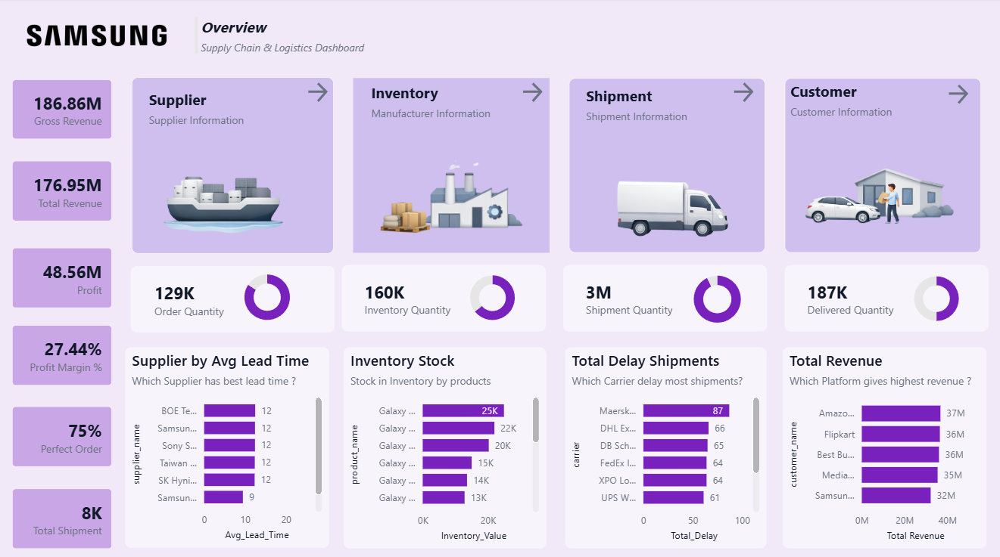
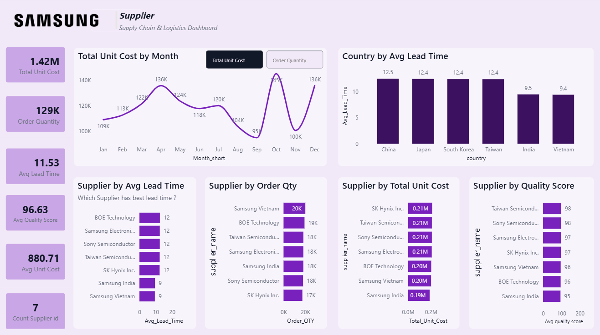
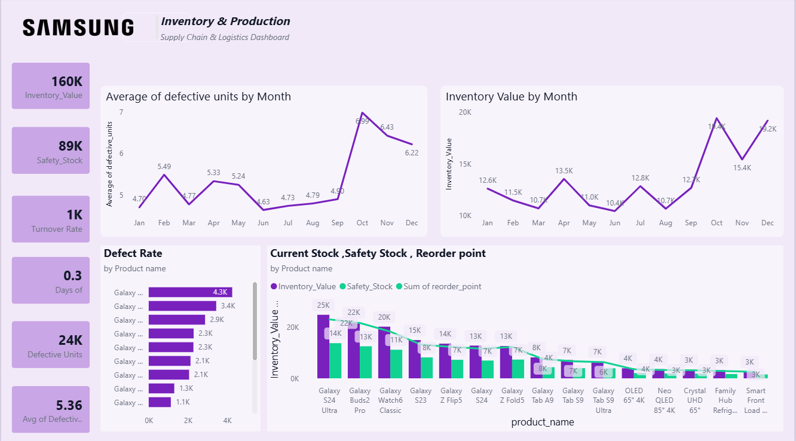
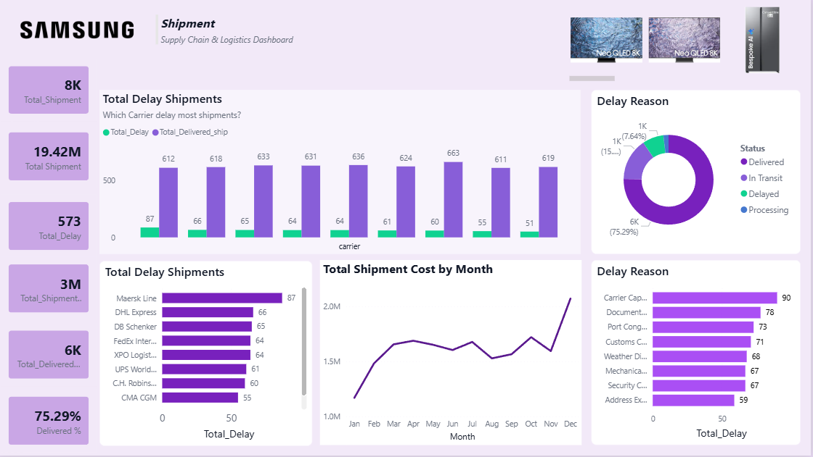
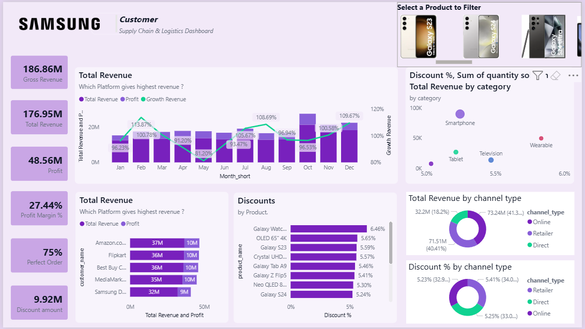

# 📦 Supply Chain & Logistics Analytics Dashboard (Power BI)

## 📖 Project Overview
This Power BI dashboard provides an end-to-end analysis of Samsung’s supply chain and logistics operations using dummy data.  
It integrates data across suppliers, inventory, shipments, and sales channels to deliver a unified view of operational efficiency, cost performance, and profitability.

The goal of this project is to identify bottlenecks, optimize logistics performance, and support data-driven decision-making across the supply chain.

---

## 📊 Key Performance Indicators (KPIs)
- **Gross Revenue:** 186.86M  
- **Net Revenue:** 176.95M  
- **Total Profit:** 48.56M  
- **Profit Margin:** 27.44%  
- **Perfect Order Rate:** 75%  
- **Total Shipments:** 8,000  
- **Total Discount Impact:** 9.92M  
- **Average Supplier Lead Time:** 11.53 days  
- **Average Supplier Quality Score:** 96.63  

---

## 🔍 Key Business Insights
- **Revenue Concentration:** Retailers (41.3%) and Direct channels (40.4%) drive the majority of revenue, indicating strong dependence on key sales channels.  
- **Top Performing Platforms:** Amazon, Flipkart, and Best Buy are the highest revenue-generating platforms, each contributing ~36–37M in sales with strong profitability.  
- **Supplier Efficiency:** Significant variation in supplier lead times across countries; India and Vietnam show higher efficiency (~9 days), while China and Japan exhibit longer cycles (~12 days).  
- **Inventory Fluctuations:** Seasonal spikes observed in inventory levels, particularly in October and December, indicating demand-driven stock buildup.  
- **Logistics Delays:** Carriers such as Maersk and DHL show higher delay frequencies, primarily due to port congestion, customs clearance, and weather disruptions.  
- **Discount Strategy Impact:** Premium products like Galaxy Watch and OLED TVs receive higher discounts, balancing customer acquisition with margin protection.  

---

## ⚙️ Skills Demonstrated
- Data cleaning & transformation (Power Query)  
- Data modeling and relationship building  
- KPI development using DAX  
- Interactive dashboard design in Power BI  
- Supply chain performance analysis  
- Business storytelling through data visualization  

---

## 🎯 Business Impact
This dashboard enables stakeholders to:

- **Optimize revenue streams** by identifying high-performing sales channels and platforms  
- **Improve supplier performance** through lead time and quality score benchmarking  
- **Enhance inventory planning** using seasonal demand and stock trend analysis  
- **Reduce logistics inefficiencies** by tracking shipment delays and root causes  
- **Improve pricing strategy** through discount and margin analysis  

---

## 🛠️ Tools & Technologies
- Power BI (Data modeling, visualization, DAX, Power Query)  
- Excel / CSV datasets  

---

## 📂 Repository Structure
- `/data` → Raw and processed datasets  
- `.pbix` → Power BI dashboard file  
- `/images` → Dashboard screenshots and visuals  

---

## 📸 Dashboard Preview

  
  
  
  
  
  